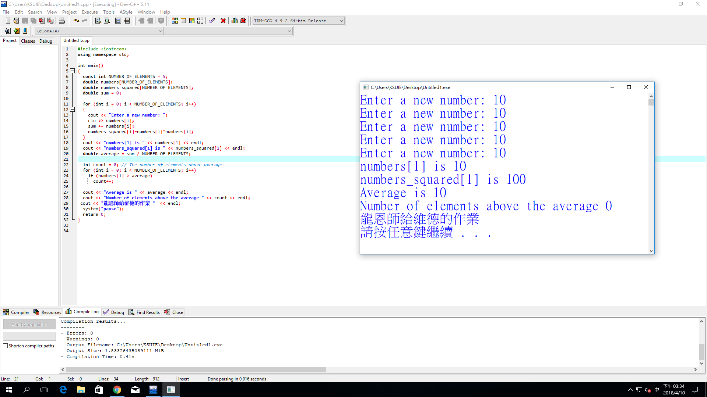

###### exercise1:陣列存取與基本運算
```
把一個陣列元素全部都平方存到另一個陣列
把一個陣列元素全部都反轉存到另一個陣列
改自教科書範例
```

```
#include <iostream>
using namespace std;

int main()
{
  const int NUMBER_OF_ELEMENTS = 2;
  double numbers[NUMBER_OF_ELEMENTS];
  double numbers_squared[NUMBER_OF_ELEMENTS];
  double sum = 0;

  for (int i = 0; i < NUMBER_OF_ELEMENTS; i++)
  {
    cout << "Enter a new number: ";
    cin >> numbers[i];
    sum += numbers[i];
    numbers_squared[i]=numbers[i]*numbers[i];
  }
  cout << "numbers[1] is " << numbers[1] << endl;
  cout << "numbers_squared[1] is " << numbers_squared[1] << endl;
  
  double average = sum / NUMBER_OF_ELEMENTS;

  int count = 0; // The number of elements above average
  for (int i = 0; i < NUMBER_OF_ELEMENTS; i++)
    if (numbers[i] > average)
      count++;

  cout << "Average is " << average << endl;
  cout << "Number of elements above the average " << count << endl;
  cout << "龍恩師給維德小小的作業"  << endl;
  system("pause"); 
  return 0;
}


```
```
說明:
numbers_squared[i]=numbers[i]*numbers[i];


```

